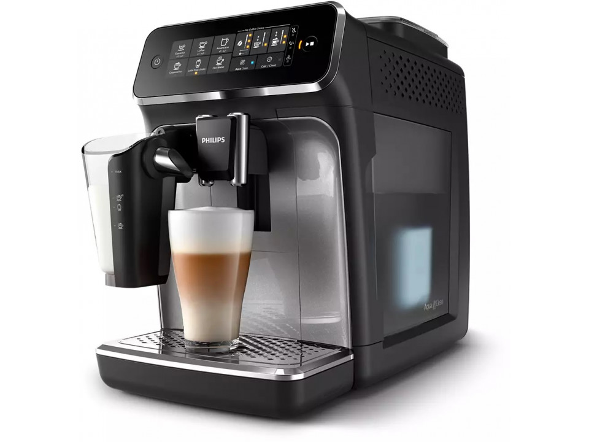

# HW 18, Coffee Machine Emulator HW

## Mandatory part

Користуючись підготовленим рішенням, розширити емулятор, додавши декілька нових фічей з використанням ООП

1. Реалізувати можливість приготування Cappuccino:
    1. розширити клас DrinkProgram, реалізувавши необхідний код для обробки вибору Cappuccino
	 
	
    2. реалізувати заготовку класу MilkReservoir як один з необхідних компонентів при приготуванні Cappuccino
	 
	
    3. _Розширити/модифікувати інші компоненти за потреби при реалізації функціонала приготування Cappuccino: значення enum class'ів, нові enum class'и, нові методи, дата мембери, класи за необхідності, тд_
    * Для зручності потенційні місця змін коду додатково позначені коментарем **//TODO HW**
	 
	

## Additional part
1. Реалізувати розширену логіку роботи "Молочного контейнера":
    1. Після оновлення об'єму через певний час(див. Лекцію 13, робота з часом) молоко переходитиме в стан "зіпсоване", відповідно приготування напоїв з використанням молока неможливе, поки вміст контейнеру не буде оновлено

## Links
Див. [Markdown Live Preview](https://markdownlivepreview.com/) для швидкого ознайомлення з форматом MD для зручного написання документацій з форматуванням на гітхабі

