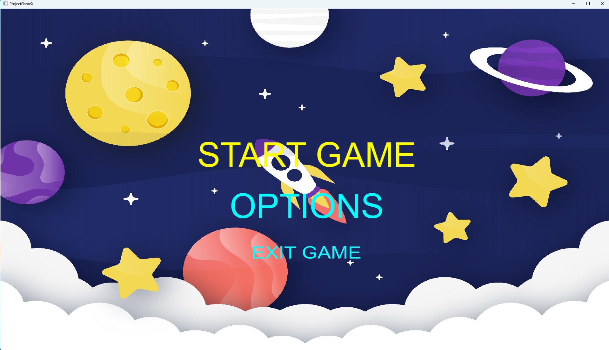
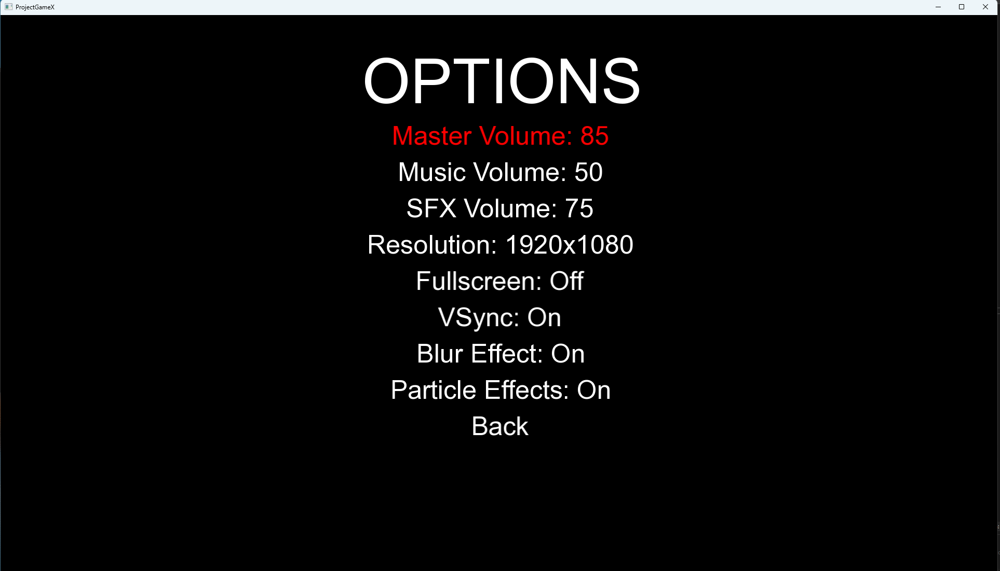
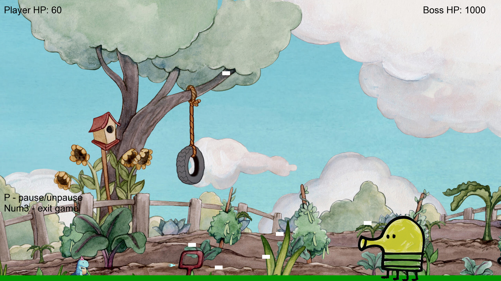
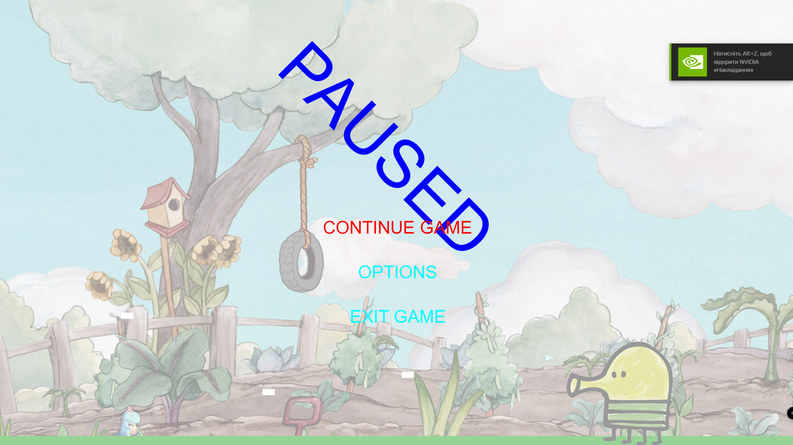

# 🎮 ProjectGameX

## a. Опис обраної теми та жанру, назва гри

**Назва гри:** ProjectGameX  
**Жанр:** 2D платформер з боєм проти боса у стилі *Cuphead*

**Тема гри:**  
Гравець кидає виклик могутньому босу на фантастичній арені. Усе відбувається в швидкому темпі, з акцентом на ухилення, платформінг та стрільбу. Мета — перемогти боса, який змінює фази поведінки під час бою.

---

## b. Опис основного флоу гри

1. **Старт гри:**  
   - Гравець потрапляє на титульний екран з опцією *Start*, *Options* та *Exit*.
   - При виборі *Start*, запускається ігровий рівень з гравцем та босом.

2. **Основний процес гри:**
   - Гравець керує персонажем, що може стрибати та стріляти.
   - Бій проходить проти одного складного боса, який має три фази:
     - **Фаза 1:** Повільна стрільба снарядами.
     - **Фаза 2:** Активні атаки, нові патерни снарядів.
     - **Фаза 3:** Агресивна стрільба з комбінованими атаками.

3. **Умови завершення гри:**
   - **Перемога:** Гравець знищує боса.
   - **Поразка:** Гравець втрачає все здоров’я.

4. **Переривання гри:**
   - *Escape* відкриває меню паузи.
   - Можна повернутись до гри або вийти в головне меню.

---

## c. Опис наявних механік гри

- **Персонаж гравця:**
  - Стрільба мишею в напрямку курсора
  - Стрибок (авто або через пробіл)
  - Рух вліво/вправо
  - Зміна орієнтації спрайту залежно від напрямку руху
- **Боси:**
  - Кожен бос має 3 фази
  - У кожній фазі змінюється шаблон атаки (стрільба, спавн куль, тощо)
  - Урон гравцю при контакті або попаданні кулею
- **Кулі:**
  - Кулі гравця та боса мають напрям і швидкість
- **Платформи:**
  - Статичні об'єкти, на які може стрибати гравець
- **Колізії:**
  - Кулі/гравець/бос/платформи реагують на зіткнення через CollisionManager

---

## d. Опис технічних систем, реалізованих у грі

### 🔧 Високорівневі модулі:
- **GameWorld:** керує основними об'єктами гри (гравець, бос, платформи, фон).
- **GameStateManager:** стан гри (головне меню, пауза, гра, опції).
- **WindowManager:** керування розміром та режимами вікна, викликає `onResize` у підписаних об'єктах.
- **GameStateManager:**
  - Керує станами гри: TitleScreen, Playing, Pause, Options
- **GameWorld:**
  - Відповідає за оновлення та рендер всіх об’єктів гри
- **Player & Boss:**
  - Унікальні класи з обробкою стрільби, анімацій, фази боса тощо
- **BossPhaseManager:**
  - Реалізує зміну поведінки боса в залежності від кількості HP
- **PhysicsEngine:**
  - Обробляє рух гравця, гравітацію, застосування сили імпульсу при стрибку
- **CollisionManager:**
  - Перевіряє зіткнення між усіма об’єктами гри
- **WindowManager + IResizable:**
  - Дозволяє змінювати розмір вікна гри, оновлюючи всі об’єкти
- **OptionsSystem:**
  - Збереження налаштувань звуку, графіки, управління
- **SoundManager:**
  - Відповідає за відтворення звуків гри
- **UI:**
  - Відображення стану гравця, кнопок меню, титульного екрану

---
### 🤖 Алгоритм поведінки NPC (Boss):
- Три стани/фази:
  - OnEnter / Update / OnExit методи для кожної фази.
  - Зміна фаз при зниженні HP.
  - Кожна фаза має унікальні патерни стрільби.

### 🎥 Робота з камерою:
- Камера масштабується під розмір вікна (`sf::View`).
- Центрується на арені, не слідкує за гравцем, фіксована сцена.

### 🧩 Керування в грі:
- Клавіатура:  
  - `A/D` — рух  
  - `Space` — стрибок  
  - `MouseLeft` — стрільба  
  - `Esc` — пауза

### 💾 Система збереження:
- Через `GameOptions`: налаштування відео та звуку зберігаються в `.txt` файлі (роздільна здатність, fullscreen, VSync, гучність).

### 🖼️ UI та ефекти:
- **Blur overlay:** затемнення при паузі.
- **Меню:** простий UI зі шрифтами та кнопками.
- **Опції:** налаштування відео/аудіо через OptionsState (резолюція, fullscreen, VSync, звуки, ефекти).

---

---
> **Мова реалізації:** C++  
> **Бібліотека:** SFML 3  
> **Архітектура:** об'єктно-орієнтована, із менеджерами станів, компонентною структурою.
